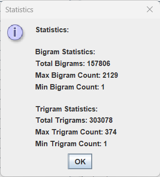

## Statistical Language model 
# Language model developed using Java
This project entails the development of a Statistical Language Model (LM) integrated with a Graphical User Interface (GUI) tailored for text input and output display. Key tasks involved in the project include implementing custom linked object structures, hash functions, and hash table creation. The GUI was designed to facilitate text input, word extraction, and statistical data visualization. Additionally, the project encompasses the development of functionality for generating vocabulary lists and n-gram language models. Through this endeavor, proficiency in Java programming, data structures, GUI development, and natural language processing techniques was achieved.

## Screenshots

 

  
  

